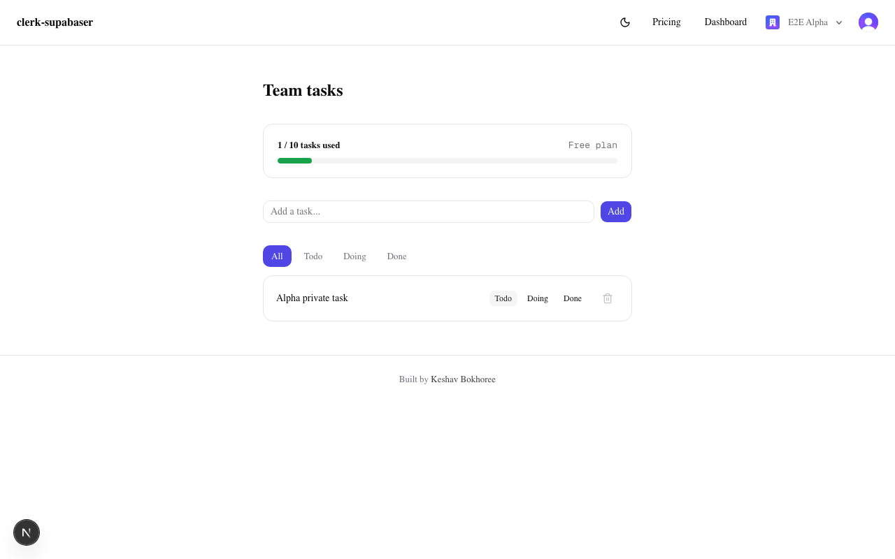

# clerk-supabaser

[](https://github.com/Keshav03/clerk_supabaser/actions/workflows/ci.yml)
**[Live demo](https://clerk-supabaser.vercel.app)** · sign up, create an organization, and the dashboard is yours.



A small multi-tenant task app built with Next.js, [Clerk](https://clerk.com) and [Supabase](https://supabase.com). Users belong to organizations, and every task belongs to an organization rather than to a person — so switching orgs switches the whole workspace.

I started this as a plain Clerk + Supabase wiring exercise and kept going, mostly because I wanted to understand how tenant isolation actually gets enforced rather than just filtering rows in a query and hoping for the best.

## The part I'd want to talk about

Task isolation is enforced by Postgres, not by application code.

Clerk and Supabase are linked through Supabase's third-party auth integration, so the session token Clerk issues is the same token Postgres verifies. When you have an organization selected, that token carries the org id, and Row Level Security compares it against every row:

```sql
using (org_id = (select auth.jwt()->'o'->>'id'))
```

One thing that cost me an afternoon: Clerk nests the organization under an `o` claim (`o.id`, `o.rol`) rather than exposing a top-level `org_id`. If you write policies against `auth.jwt()->>'org_id'` they don't error, they just silently match nothing and every query comes back empty.

This means the app code doesn't filter by user at all. `select * from tasks` returns exactly the tasks the caller is allowed to see, because Postgres refuses to hand over anything else. The `.eq("org_id", orgId)` you'll find in the queries is belt-and-braces, not the actual boundary.

### Deleting is admin-only, checked three times

Members can create tasks and move them between states. Only org admins can delete. That rule is enforced at three levels, deliberately:

1. **UI** — the dashboard passes a `canDelete` boolean down and the trash icon isn't rendered for members. Cosmetic only.
2. **Server action** — `deleteTask` checks `has({ permission: "org:tasks:delete" })` before touching the database. This is the real gate for anyone calling the endpoint directly.
3. **RLS** — the delete policy additionally requires `auth.jwt()->'o'->>'rol' = 'admin'`, so even a hand-rolled Supabase call from the browser console gets rejected.

Any one of those could be bypassed on its own. The database one can't.

### Writes go through server actions

Every write is a server action that reads `orgId` and `userId` from `auth()` and binds them itself. The client never supplies a tenant id, because a client-supplied tenant id is just a cross-tenant write waiting to happen.

Plan limits are enforced the same way. The dashboard swaps the form for an upgrade prompt when you're at your limit, but that's a hint — `createTask` counts the org's tasks server-side and refuses the insert. Hiding a form is not enforcement.

## Tests

Cross-org isolation is covered end to end with Playwright:

```bash
npm run test:e2e
```

The suite provisions two users in two separate organizations through Clerk's Backend API, seeds one task into each org through the app's own UI, then asserts that each tenant sees its own task and not the other's. Sign-in uses Clerk's testing tokens to get past bot detection, and each session picks an active organization explicitly — a session without one carries no `o.id` claim, so there's no tenant for RLS to match and the dashboard has nothing to show.

If you're reading the code, one experiment is worth more than the rest of this README: delete the `.eq("org_id", orgId)` from the dashboard query and run the suite again. It still passes, because the isolation was never coming from that line.

## Architecture

```
Browser
   │
   ▼
Next.js (App Router)
   ├── proxy.ts ............. Clerk middleware; attaches the session
   ├── Server Components .... read data, already authenticated
   ├── Server Actions ....... all writes; bind org_id from auth()
   └── /api/webhooks/clerk .. verified billing events
   │
   ├──────── Clerk ......... identity, orgs, roles, billing plans
   │           │
   │           └── session token (sub, o.id, o.rol)
   ▼
Supabase / Postgres
   └── RLS evaluates auth.jwt() on every statement
```

Two Supabase clients, for two different situations:

- `src/lib/supabase/server.ts` and `client.ts` attach the caller's Clerk token, so RLS applies.
- `src/lib/supabase/admin.ts` uses the service role key and bypasses RLS. It exists only for the webhook handler, which receives no user session and therefore has no token to send. It's server-only for obvious reasons.

## Running it locally

Clone it, then follow [SETUP.md](SETUP.md) — you'll need a Clerk application and a Supabase project, plus a few dashboard settings that can't be scripted.

```bash
npm install
npm run dev
```

## Where things are

```
src/
  proxy.ts                     Clerk middleware (Next 16 renamed middleware.ts)
  app/
    dashboard/page.tsx         org-scoped task list, status filters, usage bar
    dashboard/actions.ts       every write: create, status change, delete
    api/webhooks/clerk/        verified Clerk billing events
    pricing/page.tsx           Clerk PricingTable
  lib/
    plans.ts                   active plan slug → task limit
    tasks.ts                   task status union, labels, type guard
    supabase/                  server, browser and service-role clients
```

Status filtering is driven by the URL (`/dashboard?status=doing`) rather than client state, so a filtered view is shareable and the filtering happens in Postgres.

## Things I know are missing

Being upfront about the edges rather than pretending they aren't there:

- **The plan limit check has a race.** Two simultaneous requests can both read the count before either inserts. Fixing it properly means moving the rule into a `BEFORE INSERT` trigger so the count and the insert are atomic. The application check gives a good error message; it isn't a guarantee.
- **Test coverage stops at isolation.** Playwright covers cross-org isolation and sign-out. Admin-only delete and the plan limit are still checked by hand.
- **Migrations are hand-run SQL.** Fine for one developer against one database. On a team I'd use the Supabase CLI with migrations in version control and applied in CI.
- **Deletes are hard deletes.** No soft delete or recovery.
- **Development Clerk keys.** Not yet running against a production Clerk instance.
